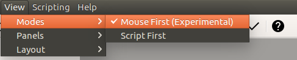

[< Back to Traditional CAD Documentation](index.md)
## Getting Started

### Mouse First Mode

The first thing to do after starting CQCad is to change the view mode to "Mouse First" (View->Modes->Mouse First).

Mouse First mode is marked as experimental. This is because the point-and-click functionality of the CQCad interface will lag behind other aspects of the GUI. Mouse First mode is meant to give a preview of what is possible with CQCad, and give traditional CAD users a chance to give feedback on the direction CQCad is taking.
